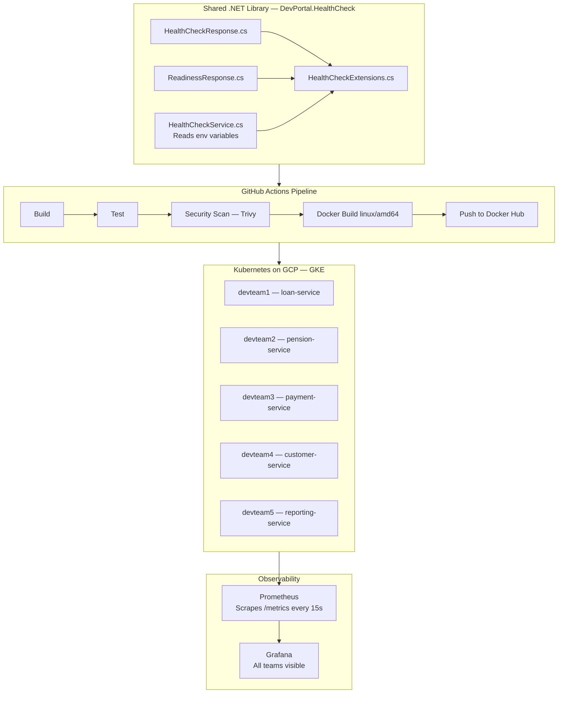

# devportal

A platform engineering POC of how a shared standard library reduces chaos across development teams.

---

## The Problem

In large engineering organisations, development teams make their own decisions about how to implement health checks, logging, and observability. The result is inconsistency — some teams have proper health reporting, others have nothing. 

This is a way to demonstrates how a good standard can solves that problem.

---

## The Solution

A shared .NET library that any service can adopt with two lines of code. The library provides:

- A standardised `/health` endpoint — used by Kubernetes for liveness probes
- A standardised `/ready` endpoint — used by Kubernetes for readiness probes  
- A `/metrics` endpoint — scraped by Prometheus every 15 seconds

Every service that adopts the library immediately appears in Grafana with full observability.

```csharp
// Two lines. That's all a development team needs to do.
builder.Services.AddDevPortalHealthCheck();
app.UseDevPortalHealthCheck();
```

---

## Architecture



---

## Tech Stack

| Technology |
|---|
| .NET 8, C# |
| Trivy |
| Docker |
| CitHub Actions |
| Kubernetes — GKE on GCP |
| Terraform |
| Prometheus |
| Grafana |

---

## The Health Check Library

The library returns response from every service that includes it:

```json
{
  "status": "healthy",
  "service": "loan-service",
  "team": "devteam1",
  "version": "1.0.0",
  "environment": "production",
  "timestamp": "2026-05-23T18:40:22Z"
}
```


