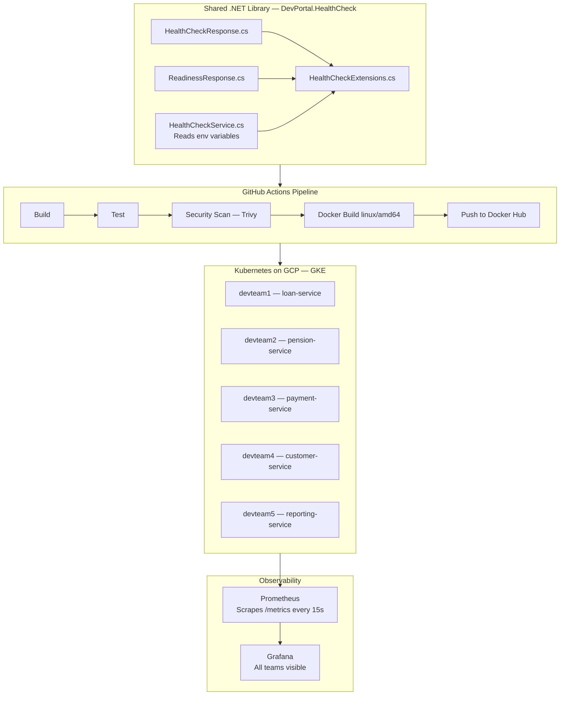

# devportal

> A platform engineering proof of concept demonstrating how a shared standard reduces chaos across development teams — from invisible services to full observability in one pipeline.

---

## The Problem

In large engineering organisations, development teams make their own decisions about how to implement health checks, logging, and observability. The result is inconsistency — some teams have proper health reporting, others have nothing. When something breaks at 3am, the platform team has no visibility into which service is down or why.

This project demonstrates how a platform team solves that problem.

---

## The Solution

A shared .NET library that any service can adopt with two lines of code. The library provides:

- A standardised `/health` endpoint — used by Kubernetes for liveness probes
- A standardised `/ready` endpoint — used by Kubernetes for readiness probes  
- A `/metrics` endpoint — scraped by Prometheus every 15 seconds

Every service that adopts the library immediately appears in Grafana with full observability. The platform team enforces the standard through the CI/CD pipeline — not through manual reviews or documentation that nobody reads.

```csharp
// Two lines. That's all a development team needs to do.
builder.Services.AddDevPortalHealthCheck();
app.UseDevPortalHealthCheck();
```

---

## Architecture



---

## Tech Stack

| Layer | Technology |
|---|---|
| Shared library | .NET 8, C# |
| Testing | xUnit — 4 automated tests |
| Security scanning | Trivy |
| Containerization | Docker — multi-stage, chiseled image |
| CI/CD | GitHub Actions |
| Container registry | Docker Hub |
| Orchestration | Kubernetes — GKE on GCP |
| Infrastructure as Code | Terraform |
| Monitoring | Prometheus |
| Visualization | Grafana |
| Cloud | Google Cloud Platform |

---

## Repository Structure

```
devportal/
├── .github/
│   └── workflows/
│       └── ci-cd.yml              # Pipeline: build, test, scan, deploy
├── src/
│   ├── DevPortal.HealthCheck/     # Shared .NET library
│   │   └── DevPortal.HealthCheck/
│   │       ├── HealthCheckExtensions.cs
│   │       ├── HealthCheckResponse.cs
│   │       ├── HealthCheckService.cs
│   │       ├── ReadinessResponse.cs
│   │       └── DevPortal.HealthCheck.csproj
│   ├── DevPortal.HealthCheck.Tests/  # xUnit tests
│   └── DevPortal.App/             # Minimal .NET host app
│       ├── Program.cs
│       ├── Dockerfile
│       └── DevPortal.App.csproj
├── infra/
│   ├── terraform/                 # GKE cluster provisioning
│   │   ├── main.tf
│   │   ├── providers.tf
│   │   └── variables.tf
│   ├── k8s/                       # Kubernetes manifests
│   │   ├── namespace.yaml
│   │   ├── deployment.yaml        # 5 team deployments
│   │   └── service.yaml
│   └── monitoring/                # Prometheus + Grafana
│       ├── prometheus-config.yaml
│       ├── prometheus-deployment.yaml
│       ├── grafana-config.yaml
│       └── grafana-deployment.yaml
└── README.md
```

---

## The Pipeline

Every push to `main` triggers the full pipeline automatically:

```
Push to GitHub
→ Build .NET library
→ Run 4 automated tests — stops if any fail
→ Trivy security scan — stops on CRITICAL vulnerabilities
→ Docker build for linux/amd64
→ Push to Docker Hub
```

Security is not optional. The pipeline enforces it on every single deployment — no exceptions, no manual overrides. Trivy scans every Docker image before it reaches Kubernetes. Critical vulnerabilities stop the pipeline automatically.

---

## The Health Check Library

The library returns a standardised response from every service that adopts it:

```json
{
  "status": "healthy",
  "service": "pension-service",
  "team": "devteam2",
  "version": "1.0.0",
  "environment": "production",
  "timestamp": "2026-05-23T18:40:22Z"
}
```

No values are hardcoded. Everything is injected by Kubernetes at runtime through environment variables — the same image runs for all teams, only the configuration differs. This is the golden path in practice: the platform team writes the standard once, Kubernetes configures it per team.

---

## Running Locally

### Prerequisites
- Docker
- kubectl
- Terraform
- gcloud CLI
- .NET 8 SDK

### Spin up the full stack

```bash
# Provision GKE cluster
cd infra/terraform
terraform init
terraform apply -var="project_id=YOUR_GCP_PROJECT_ID"

# Connect kubectl
gcloud container clusters get-credentials devportal-cluster \
  --region europe-west1-b \
  --project YOUR_GCP_PROJECT_ID

# Deploy everything
kubectl apply -f infra/k8s/namespace.yaml
kubectl apply -f infra/k8s/deployment.yaml
kubectl apply -f infra/k8s/service.yaml
kubectl apply -f infra/monitoring/prometheus-config.yaml
kubectl apply -f infra/monitoring/prometheus-deployment.yaml
kubectl apply -f infra/monitoring/grafana-config.yaml
kubectl apply -f infra/monitoring/grafana-deployment.yaml

# Open Grafana
kubectl port-forward svc/grafana 3000:3000 -n devportal
# http://localhost:3000 — admin / devportal123
```

### Tear down

```bash
cd infra/terraform
terraform destroy -var="project_id=YOUR_GCP_PROJECT_ID"
```


